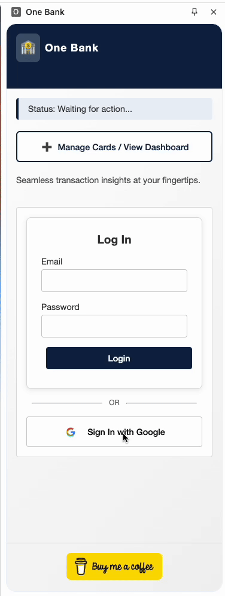

I'll update the README to reflect that your frontend directory is named "onebank-frontend" instead of just "frontend":

# One Bank

## Project Overview

One Bank is an innovative platform designed to help users optimize their credit card usage by dynamically recommending the best credit card for each transaction based on benefits like cashback.

## Demo

### website demo

<div align="center">
  
</div>

### plugin demo

<div align="center">
  
</div>

## Features

### 🔐 User Management and Card Portfolio
- Secure user authentication with email/password and Google sign-in
- Intuitive credit card portfolio management system
- Card registration without storing sensitive financial information
- Support for multiple card types and issuers
- User preference settings for reward optimization (cashback, miles, points)

### 🤖 Intelligent Recommendation Engine
- AI-powered transaction categorization using OpenAI's GPT API
- Real-time card selection optimization based on:
  - Merchant type
  - Transaction amount
  - Specific card reward structures
- Dynamic analysis of cashback and reward potential
- Contextual recommendation system that adapts to unique transaction scenarios

### 🌐 Browser Extension Capabilities
- Automatic transaction data extraction from diverse e-commerce websites
- Multi-strategy DOM parsing techniques:
  - CSS selector-based extraction
  - Regex pattern matching
  - Contextual analysis for ambiguous transaction details
- One-click card recommendation display
- Merchant and transaction amount identification
- Compatibility across multiple e-commerce platforms

### 🎮 Interactive Playground
- Drag-and-drop card simulation environment
- Virtual point-of-sale transaction testing
- Ability to input custom merchant names and transaction amounts
- Detailed recommendation explanations
- Visualization of potential rewards across different cards

### 📊 Analytics and Insights
- Transaction history tracking
- Reward optimization visualization
- Savings calculation compared to random card selection
- Customizable date range filtering
- Detailed transaction and recommendation logging


## Prerequisites

- Python 3.8+
- Node.js 14+
- npm

## Backend Setup

1. Clone the repository
```bash
git clone https://github.com/ucey-star/OneBank.git
cd OneBank/Backend
```

2. Create a virtual environment
```bash
python -m venv venv
```

3. Activate the virtual environment
- On Windows:
```bash
venv\Scripts\activate
```
- On macOS/Linux:
```bash
source venv/bin/activate
```

4. Install dependencies
```bash
pip install -r requirements.txt
```

5. Run the backend server
```bash
python run.py
```

## Frontend Setup

1. Navigate to the frontend directory
```bash
cd ../onebank-frontend
```

2. Install npm dependencies
```bash
npm install
```

3. Build the React application
```bash
npm run build
```

4. Start  the frontend
```bash
npm start
```

The server will serve the frontend application and properly handle all routes, ensuring that navigation to pages like `/login` and `/signup` works correctly.

## Browser Plugin Setup

The browser plugin is developed for Chrome. To install:
1. Open Chrome and go to `chrome://extensions/`
2. Enable "Developer mode"
3. Click "Load unpacked" and select the plugin directory

## Configuration

- Ensure you have the necessary API keys (e.g., OpenAI) configured in your environment variables
- Update database configurations in the backend settings
- Make sure your CORS settings in the backend allow requests from your frontend domain

## Frontend Server Details

The frontend is served using a Node.js Express server that handles all routes and redirects them to the React application. This ensures that directly accessing routes like `/signup` will work properly instead of resulting in 404 errors.

The server.js file contains a simple Express configuration that:
- Serves static files from the build directory
- Redirects all routes to the React application's index.html
- Handles proper routing for single-page applications

## Future Roadmap

- Implement recommendation history
- Enhance physical card functionality
- Improve browser plugin features

## Technologies Used

- Frontend: React, Tailwind CSS, Express.js (for serving the frontend)
- Backend: Flask
- Database: 
  - development: SQLite
  - production: postgreSQL
- Browser Plugin: JavaScript, Chrome Extension API